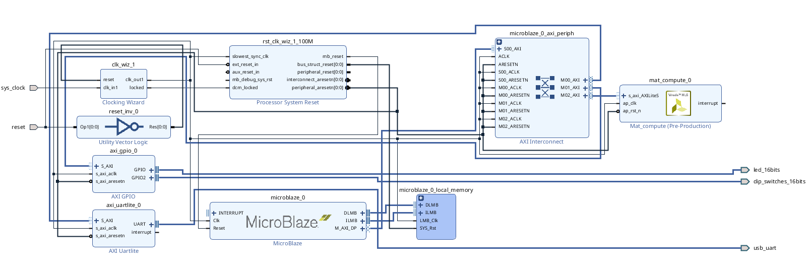
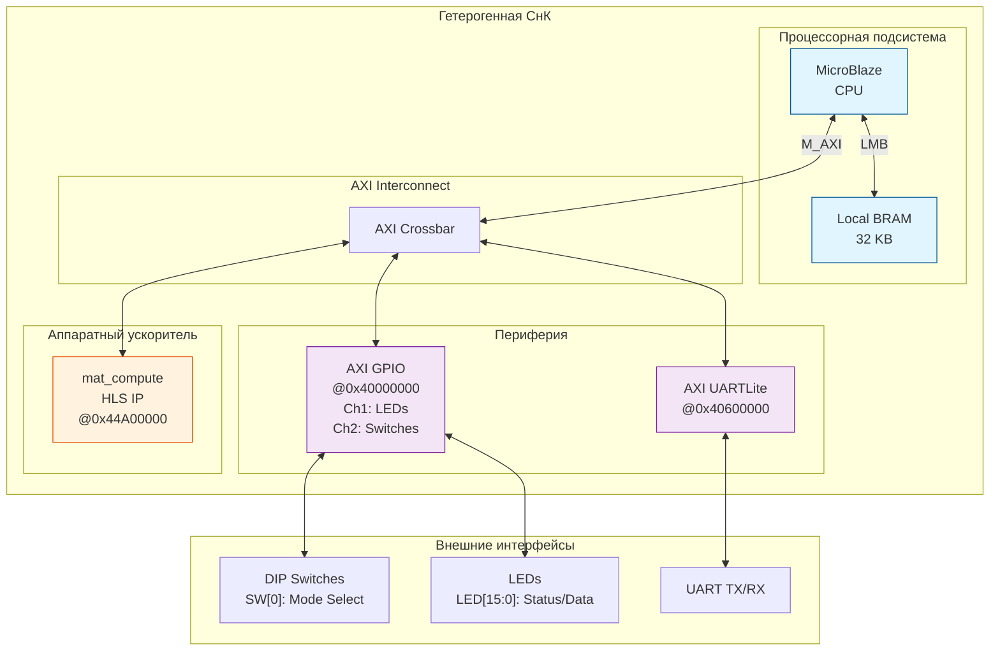
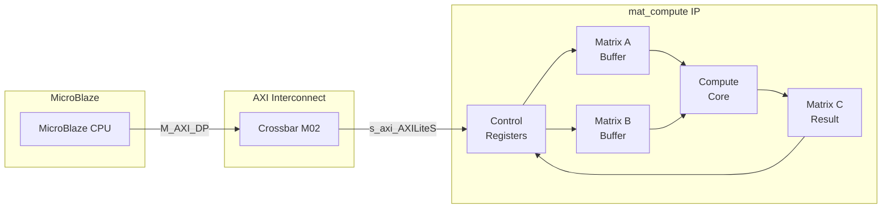
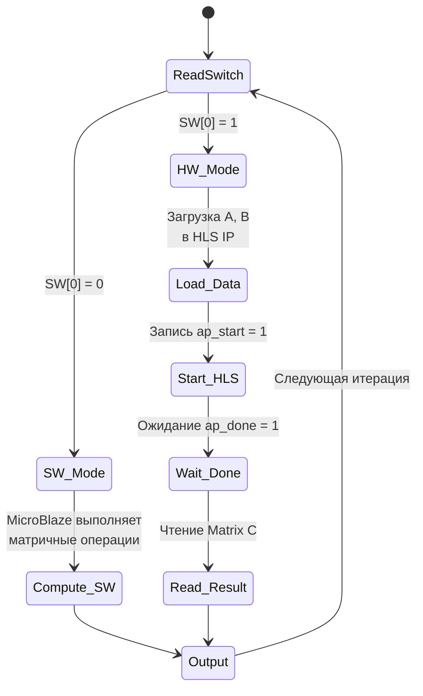
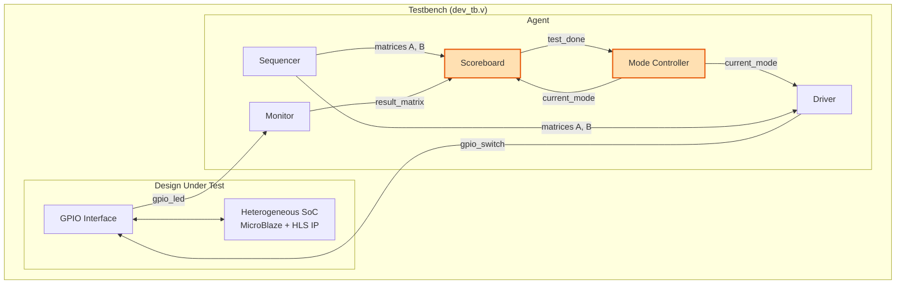
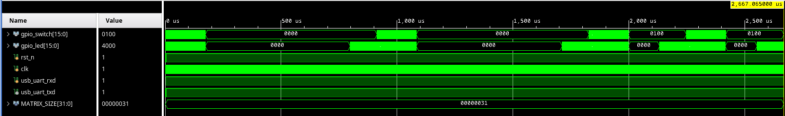

<div align="center">


<h3 style="margin-top: 50px;">Федеральное государственное автономное образовательное учреждение высшего образования</h3>

<h3 style="margin-top: 50px;">Университет ИТМО</h3>

<h3 style="margin-top: 50px;">Системы на кристалле</h3>
<h3>Лабораторная работа №4</h3>
<h3>"Проектирование гетерогенной СнК"</h3>

<h3 style="margin-top: 50px;">Вариант 1</h3>

<div style="margin-left: 500px; margin-top: 100px; text-align: right">
<h3>Выполнили:</h3>
<h4>Бутвин Михаил Павлович, Группа P3430</h4>
<h4>Николаев Павел Дмитриевич, Группа P3430</h4>
<h4>Хабнер Георгий Евгеньевич, Группа P3431</h4>
</div>

<h3 style="margin-top: 50px;">СПб – 2025</h3>
</div>
<div style="page-break-after: always;"></div>

## Вариант

**Вариант 1**: Разработать гетерогенную систему на кристалле, объединяющую программный процессор MicroBlaze и аппаратный ускоритель на базе HLS IP для вычисления `C = A + B*B` для матриц 7x7 (uint16_t)

**Особенности задания**:
- Интеграция HLS-ускорителя из лабораторной работы №3
- Возможность переключения между программным и аппаратным режимами вычислений
- Верификационное окружение на базе лабораторной работы №2 с расширенной функциональностью сравнения производительности

## Архитектура гетерогенной СнК

### Блок-дизайн системы

<div align="center">

<p><i>Рис. 1. Блок-дизайн гетерогенной СнК в Vivado</i></p>
</div>

<div style="page-break-after: always;"></div>

### Логическая архитектура системы



<div style="page-break-after: always;"></div>

### Карта адресов периферии

| Периферия | Базовый адрес | Размер | Описание |
|-----------|---------------|--------|----------|
| Local BRAM | 0x00000000 | 32 KB | Память программ и данных |
| AXI GPIO | 0x40000000 | 64 KB | LEDs (Ch1) + Switches (Ch2) |
| AXI UARTLite | 0x40600000 | 64 KB | Отладочный последовательный порт |
| mat_compute HLS | 0x44A00000 | 256 B | Аппаратный ускоритель |

### Карта регистров HLS IP (mat_compute)

| Смещение | Регистр | Описание |
|----------|---------|----------|
| 0x00 | Control | ap_start[0], ap_done[1], ap_idle[2] |
| 0x04 | GIE | Global Interrupt Enable |
| 0x08 | IER | IP Interrupt Enable |
| 0x0C | ISR | IP Interrupt Status |
| 0x40-0x70 | Matrix A | 49 элементов uint16 (упаковано по 2/слово) |
| 0x80-0xB0 | Matrix B | 49 элементов uint16 (упаковано по 2/слово) |
| 0x100-0x160 | Matrix C | 49 элементов uint16 (упаковано по 2/слово) |

<div style="page-break-after: always;"></div>

## Интеграция HLS-ускорителя

### Выбор варианта оптимизации

Для интеграции в гетерогенную СнК была выбрана **Pipeline** версия HLS-ускорителя из лабораторной работы №3:

| Параметр | Значение |
|----------|----------|
| Латентность | 741 такт |
| Время @ 100 МГц | 7.41 мкс |
| Estimated Clock | 10.858 нс |
| DSP48E | 4 |
| LUT | 1081 |

**Обоснование выбора**: Pipeline версия обеспечивает оптимальный баланс между производительностью (2.2x ускорение относительно baseline) и соблюдением временных ограничений.

### Интерфейс интеграции

HLS IP подключается к системе через **AXI4-Lite Slave** интерфейс:



<div style="page-break-after: always;"></div>

## Механизм переключения режимов

### Режимы работы

Система поддерживает два режима вычисления алгоритма `C = A + B*B`:

| Режим | SW[0] | Описание | Исполнитель |
|-------|-------|----------|-------------|
| **Software (SW)** | 0 | Программное вычисление | MicroBlaze CPU |
| **Hardware (HW)** | 1 | Аппаратное ускорение | mat_compute HLS IP |

### Логика переключения



### Управляющие сигналы GPIO

- **gpio_switch[0]** (SW[0]): Выбор режима (0=SW, 1=HW)
- **gpio_switch[8]**: Используется тестбенчем для управления режимом при симуляции
- **gpio_led[0]**: Индикация текущего режима
- **gpio_led[14]**: Флаг готовности данных (result_valid)
- **gpio_led[15]**: Флаг подтверждения приёма (ACK)

<div style="page-break-after: always;"></div>

## Модификации верификационного окружения

Верификационное окружение базируется на разработке из лабораторной работы №2 с добавлением функциональности сравнения производительности SW и HW режимов.

### Архитектура верификационного окружения



<div style="page-break-after: always;"></div>

### Ключевые изменения относительно Lab 2

#### 1. Конфигурация (tb_defines.svh)

```systemverilog
// Добавлены константы режимов
`define TEST_RUNS 4     // 2 SW + 2 HW теста
`define MODE_SW 1'b0    // Software режим
`define MODE_HW 1'b1    // Hardware режим
```

#### 2. Agent: управление режимами

```systemverilog
// Переключение режима на половине тестов
always_ff @(posedge clk_i) begin
    if (test_done) begin
        if (test_counter + 1 == `TEST_RUNS / 2) begin
            current_mode <= `MODE_HW;
            $display("\n>>> Switching to HARDWARE mode <<<\n");
        end
    end
end

// Комбинирование сигналов: режим в bit[8], данные в bits[7:0]
assign gpio_switch = {driver_gpio_switch[15:9], current_mode, driver_gpio_switch[7:0]};
```

#### 3. Scoreboard: раздельный подсчёт времени

```systemverilog
// Накопление времени по режимам
if (current_mode == `MODE_SW) begin
    sw_total_time = sw_total_time + exec_time;
    sw_test_count = sw_test_count + 1;
end else begin
    hw_total_time = hw_total_time + exec_time;
    hw_test_count = hw_test_count + 1;
end

// Вычисление speedup в final блоке
speedup = avg_sw / avg_hw;
$display("Speedup: %.2fx", speedup);
```

<div style="page-break-after: always;"></div>

## Результаты тестирования

### Временная диаграмма симуляции

<div align="center">

<p><i>Рис. 2. Временная диаграмма работы гетерогенной СнК</i></p>
</div>

### Сравнение производительности

| Режим | Среднее время | Количество тестов |
|-------|---------------|-------------------|
| **Software (MicroBlaze)** | ~827 мкс | 2 |
| **Hardware (HLS IP)** | ~335 мкс | 2 |

### Расчёт ускорения

$$\text{Speedup} = \frac{T_{SW}}{T_{HW}} = \frac{826755\ ns}{334900\ ns} \approx \mathbf{2.47x}$$

### Результаты верификации

| Тест | Режим | Результат | Время |
|------|-------|-----------|-------|
| #1 | SW | PASSED | ~827 мкс |
| #2 | SW | PASSED | ~827 мкс |
| #3 | HW | PASSED | ~335 мкс |
| #4 | HW | PASSED | ~335 мкс |

**Итого**: 4/4 тестов пройдено успешно (100%)

<div style="page-break-after: always;"></div>

## Анализ результатов

### Распределение времени в SW режиме (~827 мкс)

В программном режиме MicroBlaze выполняет:
1. Приём матриц A и B через GPIO (~150 мкс)
2. Матричное умножение B×B: O(n³) = 343 операции (~500 мкс)
3. Матричное сложение A + BB: O(n²) = 49 операций (~20 мкс)
4. Отправка результата через GPIO (~150 мкс)

### Распределение времени в HW режиме (~335 мкс)

В аппаратном режиме:
1. Приём матриц A и B через GPIO (~150 мкс)
2. Загрузка данных в HLS IP через AXI-Lite (~30 мкс)
3. **Вычисление в HLS IP: 741 такт = 7.41 мкс**
4. Чтение результата из HLS IP (~30 мкс)
5. Отправка результата через GPIO (~120 мкс)

### Источники ускорения

| Фактор | Вклад в ускорение |
|--------|-------------------|
| Параллелизм в HLS (pipeline) | Основной |
| Выделенные DSP блоки | Значительный |
| Отсутствие накладных расходов ОС | Умеренный |

<div style="page-break-after: always;"></div>

## Выводы

В ходе выполнения лабораторной работы была разработана гетерогенная система на кристалле, объединяющая программный процессор MicroBlaze и аппаратный ускоритель на базе Vivado HLS.

### Достигнутые результаты

1. **Успешная интеграция** HLS IP (mat_compute) из лабораторной работы №3 в систему на базе MicroBlaze из лабораторной работы №1

2. **Реализация двухрежимной работы** с возможностью переключения между программным и аппаратным вычислением в реальном времени через DIP-переключатель

3. **Достигнуто ускорение ~2.47x** при использовании аппаратного ускорителя:
   - Software режим: ~827 мкс
   - Hardware режим: ~335 мкс

4. **Расширение верификационного окружения** из лабораторной работы №2 для поддержки:
   - Автоматического переключения режимов
   - Раздельного измерения времени SW/HW
   - Расчёта коэффициента ускорения

### Преимущества гетерогенной архитектуры

- **Гибкость**: возможность выбора оптимального режима в зависимости от требований
- **Производительность**: значительное ускорение вычислительно-интенсивных операций
- **Масштабируемость**: архитектура позволяет добавлять дополнительные ускорители
- **Отказоустойчивость**: при отказе ускорителя система может работать в программном режиме

### Практическая значимость

Разработанная гетерогенная СнК демонстрирует эффективность подхода аппаратно-программного совместного проектирования (HW/SW Co-design) для задач с высокими требованиями к производительности при сохранении программной гибкости.
