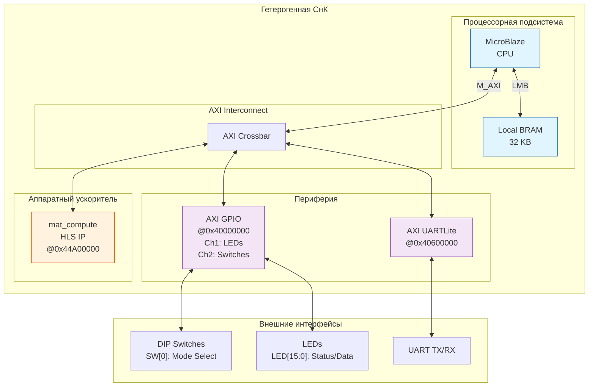
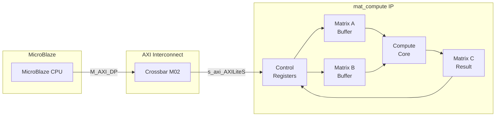
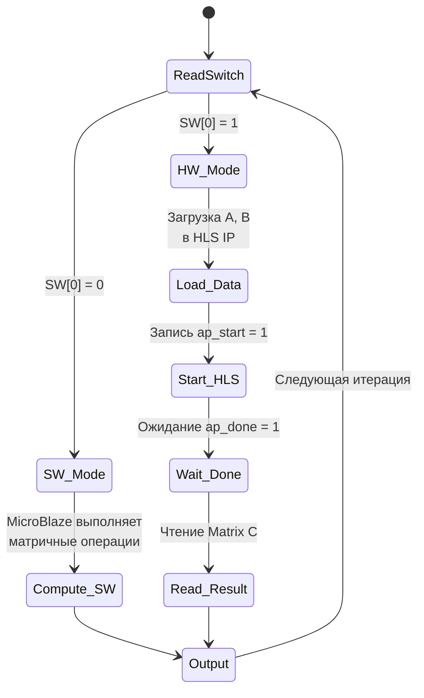
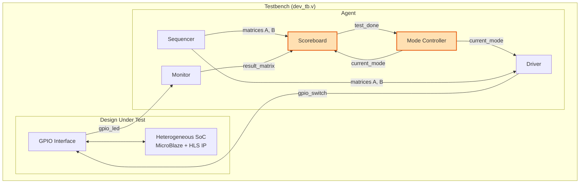

<div align="center">


<h3 style="margin-top: 50px;">Федеральное государственное автономное образовательное учреждение высшего образования</h3>

<h3 style="margin-top: 50px;">Университет ИТМО</h3>

<h3 style="margin-top: 50px;">Системы на кристалле</h3>
<h3>Лабораторная работа №4</h3>
<h3>"Проектирование гетерогенной СнК"</h3>

<h3 style="margin-top: 50px;">Вариант 1</h3>

<div style="margin-left: 500px; margin-top: 100px; text-align: right">
<h3>Выполнили:</h3>
<h4>Бутвин Михаил Павлович, Группа P3430</h4>
<h4>Николаев Павел Дмитриевич, Группа P3430</h4>
<h4>Хабнер Георгий Евгеньевич, Группа P3431</h4>
</div>

<h3 style="margin-top: 50px;">СПб – 2025</h3>
</div>
<div style="page-break-after: always;"></div>

## Вариант

**Вариант 1**: Разработать гетерогенную систему на кристалле, объединяющую программный процессор MicroBlaze и аппаратный ускоритель на базе HLS IP для вычисления `C = A + B*B` для матриц 7x7 (uint16_t)

**Особенности задания**:

- Интеграция HLS-ускорителя из лабораторной работы №3
- Возможность переключения между программным и аппаратным режимами вычислений
- Верификационное окружение на базе лабораторной работы №2 с расширенной функциональностью сравнения производительности

## Архитектура гетерогенной СнК

### Программное обеспечение MicroBlaze

1. **helloworld.c (Testbench версия)**
   - Используется при симуляции в Vivado
   - Получает матрицы A и B от тестбенча через GPIO handshake
   - Отправляет результат обратно тестбенчу для автоматической верификации

2. **helloworld_fpga.c (FPGA версия)**
   - Используется для демонстрации на реальной плате Nexys4 DDR
   - Содержит предопределённые тестовые матрицы

### Блок-дизайн системы

<div align="center">

<p><i>Рис. 1. Блок-дизайн гетерогенной СнК в Vivado</i></p>
</div>

<div style="page-break-after: always;"></div>

### Логическая архитектура системы



<div style="page-break-after: always;"></div>

### Карта адресов периферии

| Периферия       | Базовый адрес | Размер | Описание                         |
| --------------- | ------------- | ------ | -------------------------------- |
| Local BRAM      | 0x00000000    | 32 KB  | Память программ и данных         |
| AXI GPIO        | 0x40000000    | 64 KB  | LEDs (Ch1) + Switches (Ch2)      |
| AXI UARTLite    | 0x40600000    | 64 KB  | Отладочный последовательный порт |
| mat_compute HLS | 0x44A00000    | 256 B  | Аппаратный ускоритель            |

### Карта регистров HLS IP (mat_compute)

| Смещение    | Регистр  | Описание                                   |
| ----------- | -------- | ------------------------------------------ |
| 0x00        | Control  | ap_start[0], ap_done[1], ap_idle[2]        |
| 0x04        | GIE      | Global Interrupt Enable                    |
| 0x08        | IER      | IP Interrupt Enable                        |
| 0x0C        | ISR      | IP Interrupt Status                        |
| 0x40-0x70   | Matrix A | 49 элементов uint16 (упаковано по 2/слово) |
| 0x80-0xB0   | Matrix B | 49 элементов uint16 (упаковано по 2/слово) |
| 0x100-0x160 | Matrix C | 49 элементов uint16 (упаковано по 2/слово) |

### Сравнение утилизации ресурсов FPGA

| Ресурс     | Lab 1 (без HLS) | Lab 4 (с HLS) | Разница     | Доступно |
| ---------- | --------------- | ------------- | ----------- | -------- |
| **LUT**    | 1158 (1.83%)    | 1609 (2.54%)  | +451 (+39%) | 63400    |
| **FF**     | 950 (0.75%)     | 1433 (1.13%)  | +483 (+51%) | 126800   |
| **BRAM**   | 8 (5.93%)       | 11 (8.15%)    | +3 (+37%)   | 135      |
| **DSP48E** | 0 (0.00%)       | 7 (2.92%)     | +7          | 240      |

**Анализ прироста ресурсов:**

Добавление HLS-ускорителя mat_compute увеличило использование ресурсов:

- **DSP блоки** (+7): используются для параллельного выполнения умножений в Pipeline
- **LUT** (+39%): логика управления AXI-Lite интерфейсом и конвейером
- **FF** (+51%): регистры конвейера и буферы данных
- **BRAM** (+3): хранение матриц A, B, C внутри HLS IP

При этом общая утилизация остаётся низкой (<3% LUT, <9% BRAM), что позволяет добавлять дополнительные ускорители.

<div style="page-break-after: always;"></div>

## Интеграция HLS-ускорителя

### Выбор варианта оптимизации

Для интеграции в гетерогенную СнК была выбрана **Pipeline** версия HLS-ускорителя из лабораторной работы №3:

| Параметр        | Значение  |
| --------------- | --------- |
| Латентность     | 741 такт  |
| Время @ 100 МГц | 7.41 мкс  |
| Estimated Clock | 10.858 нс |
| DSP48E          | 4         |
| LUT             | 1081      |

**Обоснование выбора**: Pipeline версия обеспечивает оптимальный баланс между производительностью (2.2x ускорение относительно baseline) и соблюдением временных ограничений.

### Интерфейс интеграции

HLS IP подключается к системе через **AXI4-Lite Slave** интерфейс:



<div style="page-break-after: always;"></div>

## Механизм переключения режимов

### Режимы работы

Система поддерживает два режима вычисления алгоритма `C = A + B*B`:

| Режим             | SW[0] | Описание               | Исполнитель        |
| ----------------- | ----- | ---------------------- | ------------------ |
| **Software (SW)** | 0     | Программное вычисление | MicroBlaze CPU     |
| **Hardware (HW)** | 1     | Аппаратное ускорение   | mat_compute HLS IP |

### Логика переключения



### Управляющие сигналы GPIO

- **gpio_switch[0]** (SW[0]): Выбор режима (0=SW, 1=HW)
- **gpio_switch[8]**: Используется тестбенчем для управления режимом при симуляции
- **gpio_led[0]**: Индикация текущего режима
- **gpio_led[14]**: Флаг готовности данных (result_valid)
- **gpio_led[15]**: Флаг подтверждения приёма (ACK)

<div style="page-break-after: always;"></div>

## Модификации верификационного окружения

Верификационное окружение базируется на разработке из лабораторной работы №2 с добавлением функциональности сравнения производительности SW и HW режимов.

### Архитектура верификационного окружения



<div style="page-break-after: always;"></div>

### Ключевые изменения относительно Lab 2

#### 1. Конфигурация (tb_defines.svh)

```systemverilog
// Добавлены константы режимов
`define TEST_RUNS 4     // 2 SW + 2 HW теста
`define MODE_SW 1'b0    // Software режим
`define MODE_HW 1'b1    // Hardware режим
```

#### 2. Agent: управление режимами

```systemverilog
// Переключение режима на половине тестов
always_ff @(posedge clk_i) begin
    if (test_done) begin
        if (test_counter + 1 == `TEST_RUNS / 2) begin
            current_mode <= `MODE_HW;
            $display("\n>>> Switching to HARDWARE mode <<<\n");
        end
    end
end

// Комбинирование сигналов: режим в bit[8], данные в bits[7:0]
assign gpio_switch = {driver_gpio_switch[15:9], current_mode, driver_gpio_switch[7:0]};
```

#### 3. Scoreboard: раздельный подсчёт времени

```systemverilog
// Накопление времени по режимам
if (current_mode == `MODE_SW) begin
    sw_total_time = sw_total_time + exec_time;
    sw_test_count = sw_test_count + 1;
end else begin
    hw_total_time = hw_total_time + exec_time;
    hw_test_count = hw_test_count + 1;
end

// Вычисление speedup в final блоке
speedup = avg_sw / avg_hw;
$display("Speedup: %.2fx", speedup);
```

<div style="page-break-after: always;"></div>

## Результаты тестирования

### Временная диаграмма симуляции

<div align="center">

<p><i>Рис. 2. Временная диаграмма работы гетерогенной СнК</i></p>
</div>

### Сравнение производительности

| Режим                     | Среднее время | Количество тестов |
| ------------------------- | ------------- | ----------------- |
| **Software (MicroBlaze)** | ~827 мкс      | 2                 |
| **Hardware (HLS IP)**     | ~335 мкс      | 2                 |

### Расчёт ускорения

$$\text{Speedup} = \frac{T_{SW}}{T_{HW}} = \frac{826755\ ns}{334900\ ns} \approx \mathbf{2.47x}$$

### Результаты верификации

| Тест | Режим | Результат | Время    |
| ---- | ----- | --------- | -------- |
| #1   | SW    | PASSED    | ~827 мкс |
| #2   | SW    | PASSED    | ~827 мкс |
| #3   | HW    | PASSED    | ~335 мкс |
| #4   | HW    | PASSED    | ~335 мкс |

**Итого**: 4/4 тестов пройдено успешно (100%)

<div style="page-break-after: always;"></div>

## Анализ результатов

### Распределение времени в SW режиме (~827 мкс)

В программном режиме MicroBlaze выполняет:

1. Приём матриц A и B через GPIO (~150 мкс)
2. Матричное умножение B×B: O(n³) = 343 операции (~500 мкс)
3. Матричное сложение A + BB: O(n²) = 49 операций (~20 мкс)
4. Отправка результата через GPIO (~150 мкс)

### Распределение времени в HW режиме (~335 мкс)

В аппаратном режиме:

1. Приём матриц A и B через GPIO (~150 мкс)
2. Загрузка данных в HLS IP через AXI-Lite (~30 мкс)
3. **Вычисление в HLS IP: 741 такт = 7.41 мкс**
4. Чтение результата из HLS IP (~30 мкс)
5. Отправка результата через GPIO (~120 мкс)

### Источники ускорения

| Фактор                           | Вклад в ускорение |
| -------------------------------- | ----------------- |
| Параллелизм в HLS (pipeline)     | Основной          |
| Выделенные DSP блоки             | Значительный      |
| Отсутствие накладных расходов ОС | Умеренный         |

### Сравнение с результатами Lab 3

| Параметр    | Lab 3 (HLS)             | Lab 4 (Система)            |
| ----------- | ----------------------- | -------------------------- |
| Baseline    | 1598 тактов (15.98 мкс) | 827 мкс (MicroBlaze SW)    |
| Optimized   | 741 такт (7.41 мкс)     | 335 мкс (MicroBlaze + HLS) |
| **Speedup** | **2.2x**                | **2.47x**                  |

**Анализ различий:**

В Lab 3 измерялось ускорение **только вычислительного ядра** HLS IP (Pipeline vs Baseline), без учёта накладных расходов на передачу данных.

В Lab 4 измеряется ускорение **всей системы**, включая:

- Приём/передачу данных через GPIO
- Загрузку/выгрузку матриц в HLS IP через AXI-Lite
- Собственно вычисление

Системное ускорение (2.47x) превышает ускорение HLS IP (2.2x), поскольку:

1. MicroBlaze выполняет матричное умножение значительно медленнее, чем C-симуляция в Vivado HLS
2. HLS IP устраняет основной bottleneck — вычисление B×B (~500 мкс → 7.41 мкс)
3. Накладные расходы на AXI-Lite (~60 мкс) малы по сравнению с экономией на вычислениях

<div style="page-break-after: always;"></div>

### Исходный код (helloworld.c)

```c
#include "xil_io.h"
#include <stdint.h>
#include <stdio.h>
#include "platform.h"

/*===========================================================================*/
/* Hardware Addresses                                                        */
/*===========================================================================*/

#define GPIO_BASE       0x40000000
#define GPIO_LED_DATA   (GPIO_BASE + 0x0000)  /* Channel 1: LED outputs */
#define GPIO_SW_DATA    (GPIO_BASE + 0x0008)  /* Channel 2: Switch inputs */

/* HLS mat_compute Accelerator */
#define HLS_BASE        0x44A00000
#define HLS_CTRL        (HLS_BASE + 0x00)
#define HLS_A_BASE      (HLS_BASE + 0x40)
#define HLS_B_BASE      (HLS_BASE + 0x80)
#define HLS_C_BASE      (HLS_BASE + 0xC0)

#define AP_START        0x01
#define AP_DONE         0x02
#define AP_IDLE         0x04

/*===========================================================================*/
/* Constants                                                                 */
/*===========================================================================*/

#define MAT_SIZE        7
#define MAT_ELEMENTS    49
#define MODE_SW         0
#define MODE_HW         1

/*===========================================================================*/
/* GPIO Communication Protocol                                               */
/*===========================================================================*/

uint16_t get_value(void) {
    uint16_t value = Xil_In16(GPIO_SW_DATA);

    /* Wait for gpio_switch[15] = 1 (valid data from testbench) */
    while ((value & 0x8000) == 0) {
        value = Xil_In16(GPIO_SW_DATA);
    }

    /* Extract 8-bit value from lower bits */
    value = value & 0x00FF;

    /* Send acknowledgment: pulse gpio_led[15] */
    Xil_Out16(GPIO_LED_DATA, 0x8000);
    Xil_Out16(GPIO_LED_DATA, 0x0000);

    return value;
}

void send_value(uint16_t value) {
    /* Send low byte with gpio_led[14]=1 as strobe */
    uint16_t low_byte = (value & 0x00FF) | 0x4000;
    Xil_Out16(GPIO_LED_DATA, low_byte);
    Xil_Out16(GPIO_LED_DATA, 0x0000);

    /* Send high byte with gpio_led[14]=1 as strobe */
    uint16_t high_byte = ((value >> 8) & 0x00FF) | 0x4000;
    Xil_Out16(GPIO_LED_DATA, high_byte);
    Xil_Out16(GPIO_LED_DATA, 0x0000);
}

uint32_t get_mode(void) {
    return (Xil_In16(GPIO_SW_DATA) >> 8) & 0x01;
}

/*===========================================================================*/
/* Software Matrix Operations                                                */
/*===========================================================================*/

void mat_mul(uint16_t A[MAT_SIZE][MAT_SIZE], uint16_t B[MAT_SIZE][MAT_SIZE], uint16_t C[MAT_SIZE][MAT_SIZE]) {
    for (int i = 0; i < MAT_SIZE; i++) {
        for (int j = 0; j < MAT_SIZE; j++) {
            C[i][j] = 0;
            for (int k = 0; k < MAT_SIZE; k++) {
                C[i][j] += A[i][k] * B[k][j];
            }
        }
    }
}

void mat_add(uint16_t A[MAT_SIZE][MAT_SIZE], uint16_t B[MAT_SIZE][MAT_SIZE], uint16_t C[MAT_SIZE][MAT_SIZE]) {
    for (int i = 0; i < MAT_SIZE; i++) {
        for (int j = 0; j < MAT_SIZE; j++) {
            C[i][j] = A[i][j] + B[i][j];
        }
    }
}

void sw_mat_compute(uint16_t A[MAT_SIZE][MAT_SIZE], uint16_t B[MAT_SIZE][MAT_SIZE], uint16_t C[MAT_SIZE][MAT_SIZE]) {
    uint16_t temp[MAT_SIZE][MAT_SIZE];
    mat_mul(B, B, temp);
    mat_add(A, temp, C);
}

/*===========================================================================*/
/* Hardware Accelerator Driver                                               */
/*===========================================================================*/

void hls_write_matrix(uint32_t base_addr, uint16_t mat[MAT_SIZE][MAT_SIZE]) {
    uint8_t flat[MAT_ELEMENTS];
    for (int i = 0; i < MAT_SIZE; i++) {
        for (int j = 0; j < MAT_SIZE; j++) {
            flat[i * MAT_SIZE + j] = (uint8_t)(mat[i][j] & 0xFF);
        }
    }
    for (int i = 0; i < 48; i += 4) {
        uint32_t word = flat[i] | (flat[i+1] << 8) | (flat[i+2] << 16) | (flat[i+3] << 24);
        Xil_Out32(base_addr + i, word);
    }
    Xil_Out32(base_addr + 48, flat[48]);
}

void hls_read_matrix(uint32_t base_addr, uint16_t mat[MAT_SIZE][MAT_SIZE]) {
    uint8_t flat[MAT_ELEMENTS];
    for (int i = 0; i < 48; i += 4) {
        uint32_t word = Xil_In32(base_addr + i);
        flat[i]   = word & 0xFF;
        flat[i+1] = (word >> 8) & 0xFF;
        flat[i+2] = (word >> 16) & 0xFF;
        flat[i+3] = (word >> 24) & 0xFF;
    }
    flat[48] = Xil_In32(base_addr + 48) & 0xFF;
    for (int i = 0; i < MAT_SIZE; i++) {
        for (int j = 0; j < MAT_SIZE; j++) {
            mat[i][j] = flat[i * MAT_SIZE + j];
        }
    }
}

void hw_mat_compute(uint16_t A[MAT_SIZE][MAT_SIZE], uint16_t B[MAT_SIZE][MAT_SIZE], uint16_t C[MAT_SIZE][MAT_SIZE]) {
    while (!(Xil_In32(HLS_CTRL) & AP_IDLE));
    hls_write_matrix(HLS_A_BASE, A);
    hls_write_matrix(HLS_B_BASE, B);
    Xil_Out32(HLS_CTRL, AP_START);
    while (!(Xil_In32(HLS_CTRL) & AP_DONE));
    hls_read_matrix(HLS_C_BASE, C);
}

/*===========================================================================*/
/* Main Application                                                          */
/*===========================================================================*/

int main() {
    init_platform();

    while (1) {
        uint16_t A[MAT_SIZE][MAT_SIZE];
        uint16_t B[MAT_SIZE][MAT_SIZE];
        uint16_t C[MAT_SIZE][MAT_SIZE];

        /* Receive matrix A via GPIO */
        for (int i = 0; i < MAT_SIZE; i++) {
            for (int j = 0; j < MAT_SIZE; j++) {
                A[i][j] = get_value();
            }
        }

        /* Receive matrix B via GPIO */
        for (int i = 0; i < MAT_SIZE; i++) {
            for (int j = 0; j < MAT_SIZE; j++) {
                B[i][j] = get_value();
            }
        }

        /* Compute C = A + B*B based on mode */
        if (get_mode() == MODE_SW) {
            sw_mat_compute(A, B, C);
        } else {
            hw_mat_compute(A, B, C);
        }

        /* Send result matrix C via GPIO */
        for (int i = 0; i < MAT_SIZE; i++) {
            for (int j = 0; j < MAT_SIZE; j++) {
                send_value(C[i][j]);
            }
        }
    }

    cleanup_platform();
    return 0;
}
```

<div style="page-break-after: always;"></div>

<div style="page-break-after: always;"></div>

## Исходный код верификационного окружения

### 0. Configuration (tb_defines.svh)

```systemverilog
`ifndef TB_DEFINES_SVH
`define TB_DEFINES_SVH

// Matrix dimensions
`define MATRIX_SIZE 49  // 7x7 matrix flattened
`define MATRIX_DIM 7    // Matrix dimension

// Test configuration
`define TEST_RUNS 4     // Number of test iterations (2 SW + 2 HW)

// Mode definitions
`define MODE_SW 1'b0    // Software mode (MicroBlaze only)
`define MODE_HW 1'b1    // Hardware mode (HLS accelerator)

`endif  // TB_DEFINES_SVH
```

<div style="page-break-after: always;"></div>

### 1. Testbench (dev_tb.v)

```verilog
`timescale 1ns / 1ns
//////////////////////////////////////////////////////////////////////////////////
// Lab 4: Heterogeneous SoC Architecture
// Top-level Testbench
//////////////////////////////////////////////////////////////////////////////////

module dev_tb ();
    localparam MATRIX_SIZE = 49;

    wire [15:0] gpio_switch;
    wire [15:0] gpio_led;
    reg rst_n;
    reg clk;
    reg usb_uart_rxd;
    wire usb_uart_txd;

    agent agent_impl (
        .clk_i(clk),
        .rst_i(~rst_n),
        .gpio_switch(gpio_switch),
        .gpio_led(gpio_led)
    );

    design_1_wrapper uut (
        .dip_switches_16bits_tri_i(gpio_switch),
        .led_16bits_tri_o(gpio_led),
        .reset(rst_n),
        .sys_clock(clk),
        .usb_uart_rxd(usb_uart_rxd),
        .usb_uart_txd(usb_uart_txd)
    );

    initial begin
        rst_n = 0;
        clk = 0;
        usb_uart_rxd = 1;
        #200 rst_n = 1;

        $display("============================================");
        $display("Lab 4: Heterogeneous SoC Testbench");
        $display("Testing SW and HW computation modes");
        $display("============================================");
    end

    always #5 clk = ~clk;
endmodule
```

<div style="page-break-after: always;"></div>

### 2. Agent (agent.sv)

```systemverilog
`timescale 1ns / 1ps
//////////////////////////////////////////////////////////////////////////////////
// Lab 4: Heterogeneous SoC Architecture
// Agent Module - Coordinates verification components and mode switching
//////////////////////////////////////////////////////////////////////////////////

`include "tb_defines.svh"

module agent (
    input clk_i,
    input rst_i,
    output [15:0] gpio_switch,
    input [15:0] gpio_led
);

    logic [15:0] tmp_sequence[`MATRIX_SIZE];
    logic [15:0] result_sequence[`MATRIX_SIZE];
    logic sequence_valid, sequence_send, result_valid;
    logic test_done, test_start;

    integer test_counter;

    // Mode control
    logic current_mode;
    wire [15:0] driver_gpio_switch;

    sequencer sequencer_impl (
        .clk_i(clk_i),
        .rst_i(rst_i),
        .sequence_o(tmp_sequence),
        .sequence_valid_o(sequence_valid),
        .sequence_send_i(sequence_send),
        .test_start_i(test_start)
    );

    driver driver_impl (
        .clk(clk_i),
        .rst(rst_i),
        .sequence_i(tmp_sequence),
        .sequence_valid(sequence_valid),
        .sequence_send(sequence_send),
        .gpio_switch(driver_gpio_switch),
        .gpio_led(gpio_led)
    );

    monitor monitor_impl (
        .clk(clk_i),
        .rst(rst_i),
        .gpio_led(gpio_led),
        .result_matrix_o(result_sequence),
        .result_valid(result_valid),
        .test_done_i(test_done)
    );

    scoreboard scoreboard_impl (
        .clk_i(clk_i),
        .rst_i(rst_i),
        .matrix_input(tmp_sequence),
        .matrix_vld(sequence_valid),
        .result_matrix(result_sequence),
        .result_vld(result_valid),
        .current_mode(current_mode),
        .test_done(test_done)
    );

    // Combine driver GPIO with mode bit (mode in bit 8, data in bits 7:0)
    assign gpio_switch = {driver_gpio_switch[15:9], current_mode, driver_gpio_switch[7:0]};

    // Test orchestration with mode switching
    always_ff @(posedge clk_i) begin
        if (rst_i) begin
            test_counter <= 0;
            test_start   <= 1;
            current_mode <= `MODE_SW;
        end else begin
            if (test_done) begin
                test_counter <= test_counter + 1;
                if (test_counter + 1 >= `TEST_RUNS) begin
                    $display("\n=== All %0d tests completed ===", `TEST_RUNS);
                    $finish();
                end else begin
                    if (test_counter + 1 == `TEST_RUNS / 2) begin
                        current_mode <= `MODE_HW;
                        $display("\n>>> Switching to HARDWARE mode <<<\n");
                    end
                    test_start <= 1;
                end
            end else begin
                test_start <= 0;
            end
        end
    end

    initial begin
        @(negedge rst_i);
        $display("\n>>> Starting in SOFTWARE mode <<<\n");
    end

endmodule
```

<div style="page-break-after: always;"></div>

### 3. Sequencer (sequencer.sv)

```systemverilog
`timescale 1ns / 1ps
//////////////////////////////////////////////////////////////////////////////////
// Lab 4: Heterogeneous SoC Architecture
// Sequencer Module - Generates test sequences
//////////////////////////////////////////////////////////////////////////////////

`include "tb_defines.svh"

module sequencer (
    input clk_i,
    input rst_i,
    output logic [15:0] sequence_o[`MATRIX_SIZE],
    output logic sequence_valid_o,
    input sequence_send_i,
    input test_start_i
);
    localparam IDLE = 0;
    localparam SEND_A = 1;
    localparam WAIT_A = 2;
    localparam SEND_B = 3;
    localparam WAIT_B = 4;

    logic [15:0] matrix_a[`MATRIX_SIZE];
    logic [15:0] matrix_b[`MATRIX_SIZE];
    logic [2:0] state;

    function automatic logic [15:0] gen_random_value();
        int rand_choice = $urandom_range(5, 0);
        if (rand_choice == 0)
            return $urandom_range(50, 0);
        else
            return $urandom_range(150, 100);
    endfunction

    always_ff @(posedge clk_i) begin
        if (rst_i) begin
            state <= IDLE;
            for (int i = 0; i < `MATRIX_SIZE; i++) begin
                sequence_o[i] <= '0;
                matrix_a[i] <= '0;
                matrix_b[i] <= '0;
            end
            sequence_valid_o <= '0;
        end else begin
            case (state)
                IDLE: begin
                    if (test_start_i) begin
                        for (int i = 0; i < `MATRIX_SIZE; i++) begin
                            matrix_a[i] <= gen_random_value();
                            matrix_b[i] <= gen_random_value();
                        end
                        state <= SEND_A;
                    end
                    sequence_valid_o <= 0;
                end
                SEND_A: begin
                    sequence_o <= matrix_a;
                    sequence_valid_o <= 1;
                    state <= WAIT_A;
                end
                WAIT_A: begin
                    sequence_valid_o <= 0;
                    if (sequence_send_i) state <= SEND_B;
                end
                SEND_B: begin
                    sequence_o <= matrix_b;
                    sequence_valid_o <= 1;
                    state <= WAIT_B;
                end
                WAIT_B: begin
                    sequence_valid_o <= 0;
                    if (sequence_send_i) state <= IDLE;
                end
            endcase
        end
    end
endmodule
```

<div style="page-break-after: always;"></div>

### 4. Driver (driver.sv)

```systemverilog
`timescale 1ns / 1ps
//////////////////////////////////////////////////////////////////////////////////
// Lab 4: Heterogeneous SoC Architecture
// Driver Module - Drives test data to DUT via GPIO
//////////////////////////////////////////////////////////////////////////////////

`include "tb_defines.svh"

module driver (
    input clk,
    input rst,
    input [15:0] sequence_i[`MATRIX_SIZE],
    input sequence_valid,
    output logic sequence_send,
    output logic [15:0] gpio_switch,
    input [15:0] gpio_led
);
    localparam WAIT_SEQ = 0;
    localparam SEND_SEQ = 1;

    logic state;
    logic receive;
    logic [15:0] temp_matrix[`MATRIX_SIZE];
    logic [5:0] temp_idx;

    wire send_vld = gpio_switch[15];
    wire receive_vld = gpio_led[15];

    always_ff @(posedge clk) begin
        if (rst) begin
            for (int i = 0; i < `MATRIX_SIZE; i++) temp_matrix[i] <= '0;
            temp_idx <= 0;
            state <= WAIT_SEQ;
            receive <= 0;
            sequence_send <= 0;
            gpio_switch <= 0;
        end else begin
            case (state)
                WAIT_SEQ: begin
                    receive <= 0;
                    temp_idx <= 0;
                    sequence_send <= 0;
                    gpio_switch <= 0;
                    if (sequence_valid) begin
                        temp_matrix <= sequence_i;
                        state <= SEND_SEQ;
                    end
                end
                SEND_SEQ: begin
                    if (temp_idx == `MATRIX_SIZE) begin
                        state <= WAIT_SEQ;
                        sequence_send <= 1;
                        gpio_switch <= 0;
                    end else begin
                        if (send_vld) begin
                            if (receive && !receive_vld) begin
                                temp_idx <= temp_idx + 1'b1;
                                gpio_switch <= 0;
                                receive <= 0;
                            end else if (receive_vld && !receive) begin
                                receive <= 1;
                            end
                        end else begin
                            gpio_switch <= temp_matrix[temp_idx] | 16'h8000;
                        end
                    end
                end
            endcase
        end
    end
endmodule
```

<div style="page-break-after: always;"></div>

### 5. Monitor (monitor.sv)

```systemverilog
`timescale 1ns / 1ps
//////////////////////////////////////////////////////////////////////////////////
// Lab 4: Heterogeneous SoC Architecture
// Monitor Module - Captures DUT output results
//////////////////////////////////////////////////////////////////////////////////

`include "tb_defines.svh"

module monitor (
    input clk,
    input rst,
    input [15:0] gpio_led,
    output logic [15:0] result_matrix_o[`MATRIX_SIZE],
    output result_valid,
    input test_done_i
);
    localparam IDLE = 0;
    localparam RECEIVE_LOW = 1;
    localparam DELAY_LOW = 2;
    localparam RECEIVE_HIGH = 3;
    localparam DELAY_HIGH = 4;

    logic [5:0] temp_idx;
    logic [2:0] state;
    logic [7:0] low_byte;
    logic reception_done;

    always_ff @(posedge clk) begin
        if (rst) begin
            temp_idx <= 0;
            state <= IDLE;
            low_byte <= 0;
            reception_done <= 0;
            for (int i = 0; i < `MATRIX_SIZE; i++) result_matrix_o[i] <= '0;
        end else begin
            if (test_done_i) begin
                temp_idx <= 0;
                state <= IDLE;
                low_byte <= 0;
                reception_done <= 0;
            end else if (!reception_done) begin
                case (state)
                    IDLE: begin
                        if (!gpio_led[14]) begin
                            state <= RECEIVE_LOW;
                        end
                    end
                    RECEIVE_LOW: begin
                        if (gpio_led[14]) begin
                            low_byte <= gpio_led[7:0];
                            state <= DELAY_LOW;
                        end
                    end
                    DELAY_LOW: if (!gpio_led[14]) state <= RECEIVE_HIGH;
                    RECEIVE_HIGH: begin
                        if (gpio_led[14]) begin
                            if (temp_idx < `MATRIX_SIZE) begin
                                result_matrix_o[temp_idx] <= {gpio_led[7:0], low_byte};
                                temp_idx <= temp_idx + 1'b1;
                                if (temp_idx + 1 == `MATRIX_SIZE) begin
                                    reception_done <= 1;
                                end
                            end
                            state <= DELAY_HIGH;
                        end
                    end
                    DELAY_HIGH: if (!gpio_led[14]) state <= RECEIVE_LOW;
                endcase
            end
        end
    end

    assign result_valid = (temp_idx == `MATRIX_SIZE);
endmodule
```

<div style="page-break-after: always;"></div>

### 6. Scoreboard (scoreboard.sv)

```systemverilog
`timescale 1ns / 1ps
//////////////////////////////////////////////////////////////////////////////////
// Lab 4: Heterogeneous SoC Architecture
// Scoreboard Module - Verifies results and compares SW vs HW performance
//////////////////////////////////////////////////////////////////////////////////

`include "tb_defines.svh"

module scoreboard (
    input clk_i,
    input rst_i,
    input [15:0] matrix_input[`MATRIX_SIZE],
    input matrix_vld,
    input [15:0] result_matrix[`MATRIX_SIZE],
    input result_vld,
    input current_mode,
    output logic test_done
);
    localparam WAIT_A = 0;
    localparam WAIT_B = 1;
    localparam WAIT_RESULT = 2;
    localparam CHECK = 3;

    logic [15:0] matrix_a[`MATRIX_SIZE];
    logic [15:0] matrix_b[`MATRIX_SIZE];
    logic [1:0] state;

    integer log_file, start_time, end_time;
    integer test_count, tests_passed, tests_failed;
    integer sw_total_time, hw_total_time, sw_test_count, hw_test_count;

    initial begin
        log_file = $fopen("scoreboard_log.txt", "w");
        $fwrite(log_file, "Lab 4: Heterogeneous SoC - Test Results\n");
        $fwrite(log_file, "========================================\n\n");
    end

    always_ff @(posedge clk_i) begin
        if (rst_i) begin
            state <= WAIT_A;
            test_done <= 0;
            test_count <= 0;
            tests_passed <= 0;
            tests_failed <= 0;
            sw_total_time <= 0;
            hw_total_time <= 0;
            sw_test_count <= 0;
            hw_test_count <= 0;
            for (int i = 0; i < `MATRIX_SIZE; i++) begin
                matrix_a[i] <= 0;
                matrix_b[i] <= 0;
            end
        end else if (state == WAIT_A) begin
            test_done <= 0;
            if (matrix_vld) begin
                matrix_a <= matrix_input;
                state <= WAIT_B;
            end
        end else if (state == WAIT_B) begin
            if (matrix_vld) begin
                matrix_b <= matrix_input;
                start_time = $time;
                state <= WAIT_RESULT;
            end
        end else if (state == WAIT_RESULT) begin
            if (result_vld) begin
                end_time = $time;
                state <= CHECK;
            end
        end else begin
            // CHECK state
            logic [15:0] expected_matrix[`MATRIX_SIZE];
            logic [15:0] bb_matrix[`MATRIX_SIZE];
            logic test_passed;
            integer exec_time;

            test_passed = 1;
            test_count = test_count + 1;
            exec_time = end_time - start_time;

            if (current_mode == `MODE_SW) begin
                sw_total_time = sw_total_time + exec_time;
                sw_test_count = sw_test_count + 1;
            end else begin
                hw_total_time = hw_total_time + exec_time;
                hw_test_count = hw_test_count + 1;
            end

            // Compute expected: C = A + B*B
            for (int i = 0; i < `MATRIX_DIM; i++) begin
                for (int j = 0; j < `MATRIX_DIM; j++) begin
                    bb_matrix[i*`MATRIX_DIM+j] = 0;
                    for (int k = 0; k < `MATRIX_DIM; k++) begin
                        bb_matrix[i*`MATRIX_DIM+j] = bb_matrix[i*`MATRIX_DIM+j] +
                            (matrix_b[i*`MATRIX_DIM+k] * matrix_b[k*`MATRIX_DIM+j]);
                    end
                end
            end
            for (int i = 0; i < `MATRIX_SIZE; i++)
                expected_matrix[i] = matrix_a[i] + bb_matrix[i];

            // Verify
            for (int i = 0; i < `MATRIX_SIZE; i++) begin
                if (expected_matrix[i] != result_matrix[i]) begin
                    $display("MISMATCH [%0d]: exp=%0d got=%0d", i, expected_matrix[i], result_matrix[i]);
                    test_passed = 0;
                end
            end

            $display("Test #%0d [%s]: %s (time: %0t ns)",
                test_count, current_mode == `MODE_SW ? "SW" : "HW",
                test_passed ? "PASSED" : "FAILED", exec_time);

            $fwrite(log_file, "Test #%0d [%s]: %s (time: %0t ns)\n",
                test_count, current_mode == `MODE_SW ? "SW" : "HW",
                test_passed ? "PASSED" : "FAILED", exec_time);

            if (test_passed) tests_passed = tests_passed + 1;
            else tests_failed = tests_failed + 1;

            test_done <= 1;
            state <= WAIT_A;
        end
    end

    final begin
        real avg_sw, avg_hw, speedup;
        $display("\n========== FINAL SUMMARY ==========");
        $display("Total: %0d | Passed: %0d | Failed: %0d", test_count, tests_passed, tests_failed);

        if (sw_test_count > 0) begin
            avg_sw = real'(sw_total_time) / real'(sw_test_count);
            $display("SW avg: %0.0f ns", avg_sw);
        end
        if (hw_test_count > 0) begin
            avg_hw = real'(hw_total_time) / real'(hw_test_count);
            $display("HW avg: %0.0f ns", avg_hw);
        end
        if (sw_test_count > 0 && hw_test_count > 0 && avg_hw > 0) begin
            speedup = avg_sw / avg_hw;
            $display("Speedup: %.2fx", speedup);
        end
        $display("====================================\n");
        $fclose(log_file);
    end
endmodule
```

## Выводы

В ходе выполнения лабораторной работы была разработана гетерогенная система на кристалле, объединяющая программный процессор MicroBlaze и аппаратный ускоритель на базе Vivado HLS.

### Достигнутые результаты

1. **Успешная интеграция** HLS IP (mat_compute) из лабораторной работы №3 в систему на базе MicroBlaze из лабораторной работы №1

2. **Реализация двухрежимной работы** с возможностью переключения между программным и аппаратным вычислением в реальном времени через DIP-переключатель

3. **Достигнуто ускорение ~2.47x** при использовании аппаратного ускорителя:
   - Software режим: ~827 мкс
   - Hardware режим: ~335 мкс

4. **Расширение верификационного окружения** из лабораторной работы №2 для поддержки:
   - Автоматического переключения режимов
   - Раздельного измерения времени SW/HW
   - Расчёта коэффициента ускорения

### Преимущества гетерогенной архитектуры

- **Гибкость**: возможность выбора оптимального режима в зависимости от требований
- **Производительность**: значительное ускорение вычислительно-интенсивных операций
- **Масштабируемость**: архитектура позволяет добавлять дополнительные ускорители
- **Отказоустойчивость**: при отказе ускорителя система может работать в программном режиме

### Практическая значимость

Разработанная гетерогенная СнК демонстрирует эффективность подхода аппаратно-программного совместного проектирования (HW/SW Co-design) для задач с высокими требованиями к производительности при сохранении программной гибкости.
